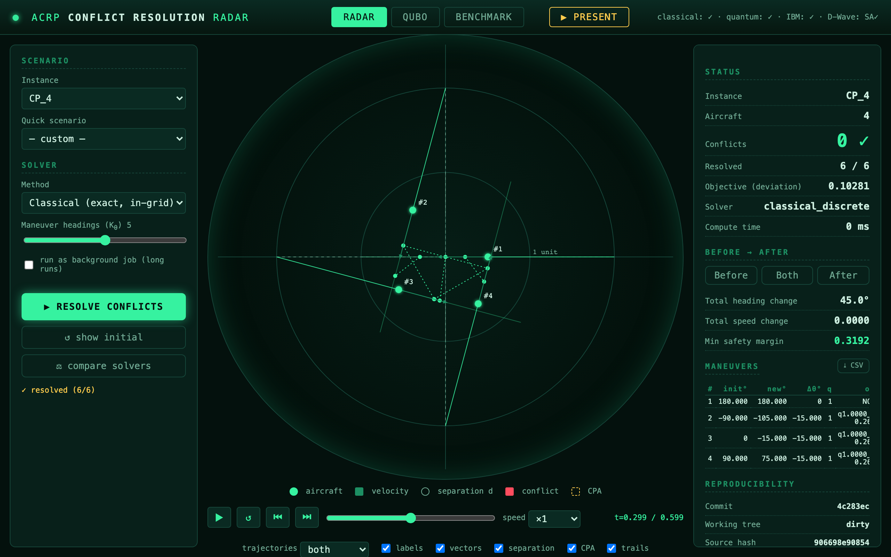
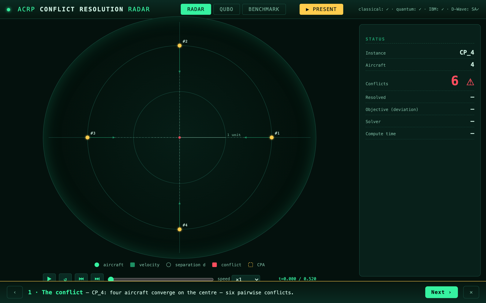
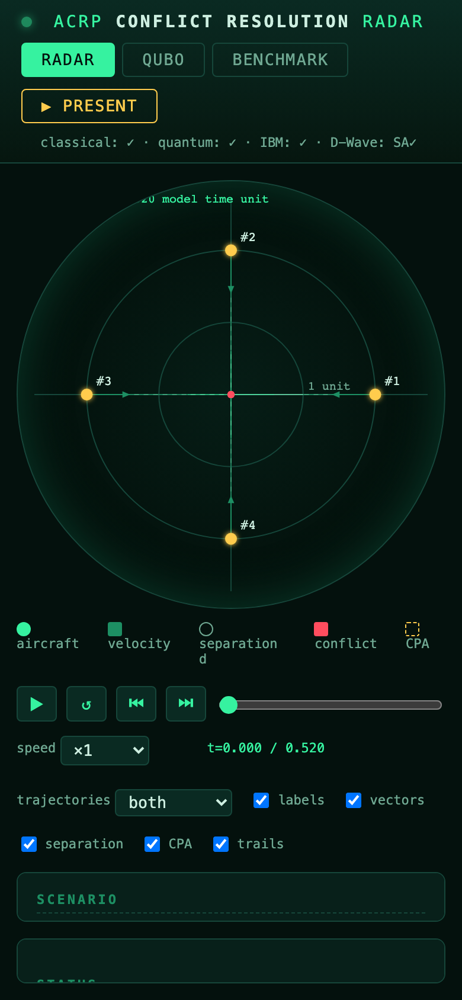

# ACRP scientific-simulator dashboard

A web dashboard that visualises ACRP instances, animates their resolution, and
compares classical / quantum-simulator / quantum-annealing routes on the same
problem — all offline, with every displayed number traceable to the API or a
versioned artifact.

```bash
pip install -e ".[quantum,dashboard]"      # +[dwave] for the annealing route
acrpq dashboard                             # -> http://127.0.0.1:8000
```

For a supervisor presentation, use the fail-closed launcher and the rehearsed
route in [`SUPERVISOR_DEMO.md`](SUPERVISOR_DEMO.md):

```bash
./scripts/demo_preflight.sh
./scripts/demo_supervisor.sh
```

> **Scientific scope.** The dashboard animates the model's **linear kinematics**
> (`position(t) = p0 + v·t`). It does **not** simulate an operational ATC system,
> human performance, communications, weather, or full aircraft dynamics. It makes
> **no quantum-advantage claim**; results on the local simulator, on a real IBM
> QPU (recorded), and on the D-Wave reference sampler are always labelled
> distinctly. Times are host/queue-dependent and not bit-reproducible.

## Demo-first interface

The dashboard opens in **Demo mode**: choose an instance, let the safe local
routes run automatically, then open **Results** for the comparison and its
plain-language interpretation. Only the defense-critical facts stay visible:
aircraft, conflicts, resolution, objective, before/after maneuvers and why each
algorithm did or did not run.

**Expert mode** reveals the single-solver controls, execution profiles, QPU
settings, radar layers, QUBO matrix, resource/energy decomposition, bitstrings,
provenance, exports and campaign evidence. It is progressive disclosure over the
same state and API calls—not a separate simplified simulator—so switching modes
cannot change a result.

The instance selector is classified for the current maneuver grid: **ALL
ALGORITHMS** contains instances where every automatic local route passes the
backend preflight; **LIMITED / SOME SKIPPED** contains instances where at least
one route cannot apply. The qubit count is shown beside each name and hovering a
limited instance gives the concrete reason. The groups update whenever the grid
changes; they are not a hard-coded size list.

The interactive comparison defaults to **K=3** heading choices per aircraft.
This is the broad-comparison setting, not a claim that three is universally
optimal: K controls discretisation resolution and computational cost. A defensible
study reports a sensitivity sweep (for example K=3, 5, 7) and retains the
smallest K after which feasibility and objective improvements are negligible for
the evaluated instance family. K=5 and K=7 remain available in Expert mode for
that robustness check.

The results table shows both wall time and **Δ time vs reference**. The delta is
the method's measured wall time minus the classical reference wall time for the
same interactive comparison. These sequential, host-dependent measurements are
useful for demo transparency, but they are not evidence of quantum speedup;
scientific timing claims require repeated seeded runs and distribution summaries.

## Tabs



- **RADAR** — a top-down view of the configured problem. Aircraft blips, velocity
  vectors, separation circles (radius `d`), and closest-point-of-approach (CPA)
  markers computed by the shared geometry kernel. A timeline scrubs model time;
  trajectories show initial (dashed) vs resolved (solid), traveled vs predicted.
- **RESULTS** — the automatic local comparison, proof status, applicability
  reasons and a plain-language result narrative. This is the second and final
  stop in the default Demo flow.
- **QUBO** *(Expert)* — the binary-quadratic reformulation of the *same* configured problem
  (subset-aware): qubit count, penalty weights, term counts and the Q matrix.
  Hovering a matrix cell gives the coefficient's operands, value and semantic
  origin (maneuver/one-hot/conflict).
- **RESULTS — expert details** — a pre-run statevector/RAM estimate, exact QUBO interaction
  components, an automatic five-route local comparison (with a **proof status**
  per result and a Cancel-all control), post-run energy decomposition, the
  dominant energy term / costliest aircraft, raw one-hot validity, disclosed
  decode repair, bit-to-aircraft mapping and the ten most probable sampled states
  when the solver provides a distribution.
- **EVIDENCE** *(Expert)* — the versioned campaign results (feasibility and approximation
  ratio vs QAOA depth, with dispersion; classical-vs-quantum table). Fully local.

## Timeline & radar controls

`▶`/`⏸` play/pause · `↺` reset · `⏮`/`⏭` step · slider · speed ×0.25–×4. Layer
toggles: trajectories (initial/resolved/both), labels, velocity vectors,
separation zones, CPA, trails. CPA markers are green (safe) / amber (near) /
red (conflict); a red blip is a conflict **active at the current time**, amber a
**predicted** conflict.

## Solvers

Method dropdown: Classical (exact grid), QUBO exact, QUBO simulated annealing,
D-Wave SA, D-Wave real QPU, QAOA (IBM gate model). **Real quantum hardware**
(IBM `ibm_real`, D-Wave QPU) always opens a confirmation modal (backend, shots,
depth, queue/cost, no-guarantee) — never launched on a bare click.

Selecting an instance or changing its grid automatically starts the safe local
comparison: discrete reference, exact QUBO, QUBO simulated annealing, D-Wave
SA and QAOA Aer. Each route has an independent outcome. An exact search beyond
its enumerative safety cap or a QAOA statevector beyond both the raw and exact
component memory limits is shown as **not applicable with the computed reason**;
it does not abort the remaining algorithms. Real IBM/D-Wave QPUs are excluded
from automatic execution. The single-solver controls remain available as an
advanced/manual path.

**⚖ compare solvers** runs classical-exact / QUBO-exact / annealing / QAOA-sim /
D-Wave-SA on the identical problem and tabulates feasibility, objective,
approximation ratio (vs the classical in-grid optimum), QUBO energy and time,
each row labelled by kind. It refuses to compare CPU and QPU times naïvely.

**Continuous baseline (read-only).** `GET /api/baseline` surfaces the
original-AMPL comparison (`baseline_all.json`) produced by the CLI
(`acrpq bench --original-ampl` or `scripts/run_original_ampl_baseline.py`).
**Decision:** AMPL execution stays in the CLI — the browser can never supply a
`.mod`/`.run`/`.dat` path nor trigger an AMPL solve, so that injection surface
does not exist. The endpoint only *displays* precomputed deltas; a missing
artifact returns an honest empty marker. See
[ORIGINAL_AMPL_BASELINE.md](ORIGINAL_AMPL_BASELINE.md).

### Going past the raw statevector wall

The local statevector limit is a RAM admission guard, not a 29-aircraft or
hardware limit. The Explain tab reports both the raw encoding and the largest
connected component of the actual non-zero QUBO interaction graph. For local
QAOA only, when the raw statevector does not fit but multiple disconnected
components each fit, the dashboard automatically runs those sub-QUBOs and
recombines their bitstrings. No coupling is discarded, so the decomposition is
exact at the model level; QAOA remains an approximate optimizer inside each
component. A joint sample distribution is deliberately not fabricated from
component marginals.

Dense instances still form a single component and receive no artificial gain.
For those, the scientifically honest options remain a coarser grid/subset, real
hardware, or MPS with its runtime/entanglement caveats.

### Preflight — one source of truth

Every applicability decision comes from a single backend endpoint
(`POST /api/preflight`): for each local method it returns whether it applies, its
resolution (exact / heuristic / approximate), the concrete reason, the search
space `K^n`, the raw qubit count, the largest exact component and the
statevector RAM ceiling. The caps are read from the solvers themselves (the
exact-QUBO one-hot enumeration cap and the reference solver's exact-search cap),
so the UI never re-derives — or disagrees with — the backend. Manual QUBO-exact
on `5^10 > 5,000,000` is reported *not applicable* with the formula, not a
generic exception. Real IBM/D-Wave QPUs are listed as excluded from any
automatic run. A running comparison can be stopped with **✕ Cancel all**, which
aborts the in-flight solve server-side and marks the remaining routes cancelled.

### Execution profiles: DEMO vs SCIENTIFIC

Every result carries an explicit profile:

- **DEMO** — the fast, single-seed interactive run (the auto-comparison uses
  256 shots / 30 iterations). Labelled and explicitly **not citable**.
- **SCIENTIFIC** — a seed-repeated measurement: give a seed list and the solver
  runs once per seed, reporting the feasibility rate and the objective
  mean ± standard deviation and spread (deterministic solvers show zero
  dispersion). Only this profile is citable and saveable.

### Explain: proof status, dominant contributors, and the gap rule

After a solve the Explain tab states a **proof status** — *exact optimum*,
*feasible heuristic*, *approximate sampled*, *infeasible*, or *not applicable* —
with a one-line caveat, plus the dominant energy term, the costliest aircraft and
the number of active conflict pairs (all recomputed from the returned bitstring,
never invented). The words **"optimality gap" are used only when the anchor is a
proven optimum**: if the reference route fell back to its heuristic, the
comparison story states plainly that Δ is a route-to-route difference, not an
optimality gap.

### Saving scientific runs

A **💾 Save scientific run** button (SCIENTIFIC profile only) writes a versioned,
fully-provenanced record to `runs/scientific/` (git-ignored): schema id, UTC
timestamp, profile, every parameter and seed, per-seed results and computed
explanations, method applicability, git commit/dirty/source-hash/dependency
versions, a configuration hash and the total duration. Interactive runs live
separately under `runs/interactive/` and are never marked citable.

**Integrity & coherence (exactly what the code does, and what it does *not*
claim).** Each artifact (the JSON, and for scientific runs a per-seed CSV) is
published with a temp-file that is fsynced then **hard-linked** into place
(`os.link`, POSIX): atomic content *and* exclusive, no-overwrite creation that
holds across processes. The commit point is a per-run `<run_id>.meta.json`
sidecar, written **last**, carrying the SHA-256 hashes of the exact JSON and CSV.
A run counts as saved **iff** its meta sidecar exists, so `list_runs` (which
simply globs the sidecars — there is **no** shared, mutable `manifest.jsonl`)
never shows a run whose artifacts are missing, and two processes saving at once
cannot lose each other's entries. If a step fails, the save rolls back its
partial files; a *crash* between the artifacts and the meta leaves only
**invisible** orphans that `recover_orphans()` deletes deterministically. The
`run_id` is a microsecond UTC stamp **plus a random nonce**, so same-second saves
of one configuration get distinct ids and never overwrite. `verify_run` /
`GET /api/runs/{kind}/{run_id}/verify` recompute the hashes and **fail loudly** on
a tampered artifact (`read_run(verify=True)` refuses it); `run_id`s are validated
against a strict pattern before any read, blocking path traversal.

This is **not** a cross-file database transaction and the code does not claim to
be one: the guarantee is "the meta sidecar is the single atomic commit point, and
anything not committed is invisible and recoverable". Integrity is
tamper-*evident* against the recorded hashes (rewriting an artifact *and* its meta
consistently would need a signature to detect, which is out of scope).

### Performance & caching

Deriving the model, not building the QUBO, is the cost that matters. Measured
medians (host-dependent, dense CP family, ~`O(n²K²)`):

| stage | 12 qubits | 50 qubits | 140 qubits |
|-------|-----------|-----------|------------|
| instance load | ~4.7 ms | ~4.7 ms | ~4.8 ms |
| `DiscreteACRP.build` | ~0.1 ms | ~2.6 ms | **~29 ms** |
| `build_qubo` | ~0.02 ms | ~0.15 ms | ~0.8 ms |

`DiscreteACRP.build` (the geometry/conflict tables) dominates `build_qubo` by an
order of magnitude, so the dashboard caches the **whole model** — `(instance,
grid, DiscreteACRP)` and the QUBO — keyed on the *complete* configuration
(instance, ordered subset, grid, weight `w`). The five auto-comparison routes and
the Explain tab therefore share one discretisation instead of rebuilding it per
route: measured ~173 ms → ~39 ms for a 140-qubit (CP_20, K=7) comparison, i.e.
**~135 ms saved**. Because the key is the whole configuration, nothing is reused
across different configurations (a change of `w` or grid is a cache miss); both
caches are bounded (16 entries) and guarded by a lock for the job-pool threads.
Resource estimates never emit the raw `2**N` integer past the simulable range (it
would bloat the payload and can overflow a float) — they report the compact GiB
figure.

## Before / after and maneuvers

After solving, the panel shows initial→resolved summary (conflicts resolved,
total heading/speed change, minimum safety margin) and a sortable per-aircraft
maneuver table (initial heading, new heading, Δθ, q, option, cost). Click a row
to highlight that aircraft on the radar; export the table as CSV.

## Long runs (async jobs)

Tick **run as background job** for heavy solves: the request is queued to a
bounded worker pool, the panel shows the live state (queued/running/…) and
elapsed time, offers **Cancel** (best-effort: effective while queued; a running
solve or a dispatched hardware job is reported as non-interruptible, not faked),
reconnects to a running job after a page reload, and keeps a short local history.

## Reproducibility & exports

The reproducibility panel shows the commit, working-tree dirty flag, source
hash, Python/Qiskit/D-Wave versions, seed, backend, grid and QUBO penalties.
Exports: full JSON, aircraft CSV, conflicts CSV, radar PNG, a self-contained
HTML report (embedded radar + maneuvers + provenance + scientific caveat), and
copy-the-equivalent-CLI-command.

## Presentation mode (defense)



Click **▶ PRESENT** for a fullscreen, enlarged, high-contrast layout with a
guided 7-step demo. Suggested 3-minute script:

1. **The conflict** — CP_4, six pairwise conflicts (red).
2. **Classical resolution** — exact in-grid solver → 0 conflicts.
3. **Watch it play out** — animate to the CPAs.
4. **The maneuvers** — per-aircraft changes and cost.
5. **QUBO reformulation** — the same problem as `H(x)`.
6. **Quantum (QAOA, simulator)** — solve the identical QUBO on Aer.
7. **Reproducibility** — provenance; IBM hardware results preserved.

Keyboard: `Space` play/pause · `R` reset · `←/→` step (or prev/next step in
present mode) · `B` before/after · `C` CPA · `F` fullscreen · `N/P` next/prev
step · `Esc` exit. The demo needs no internet and never runs a QPU.

## Offline

The dashboard bundles Chart.js locally and loads no CDN or external font; it
works with no network (verified in CI by blocking all non-localhost requests).
Versioned campaign results render even without a quantum stack installed.

## Responsive



Laptop, tablet and mobile layouts stack the panels (radar first) with a fluid
square canvas; no horizontal scroll at 1440/1280/768/390. Focus rings are
visible, status carries a glyph (not colour alone), and `prefers-reduced-motion`
is honoured.
